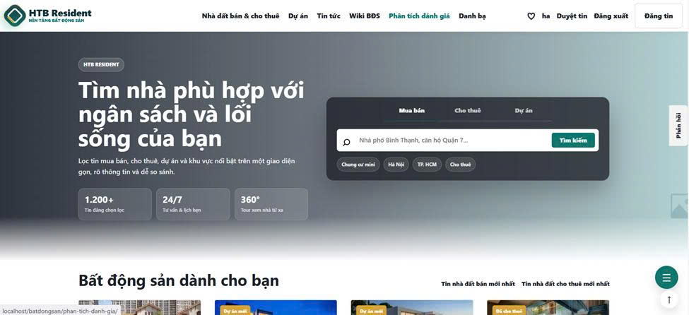
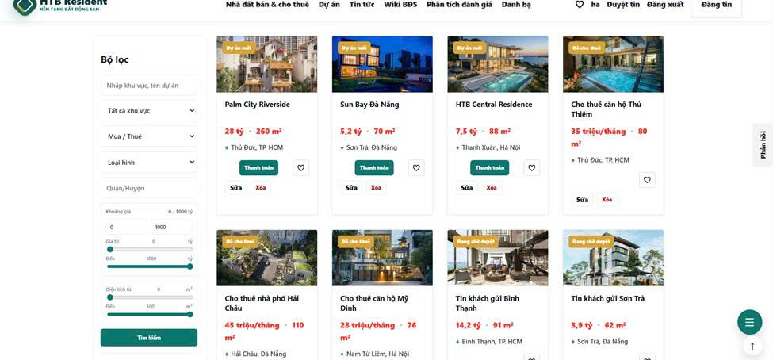
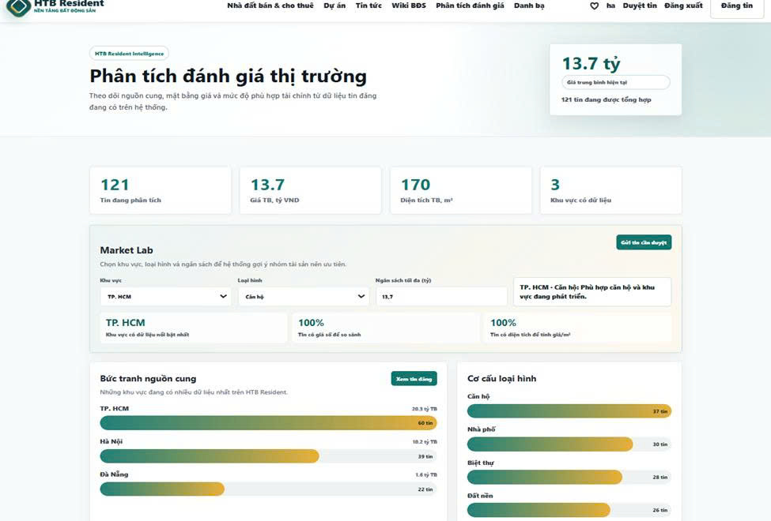
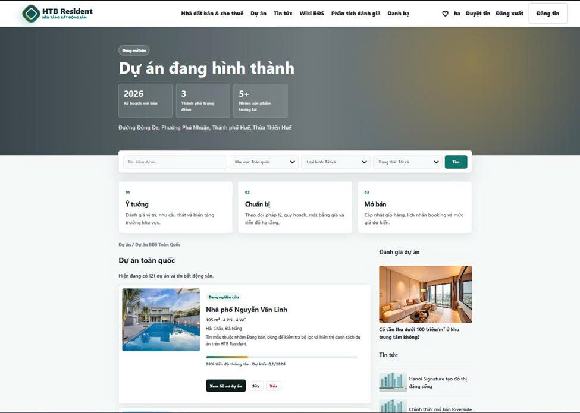
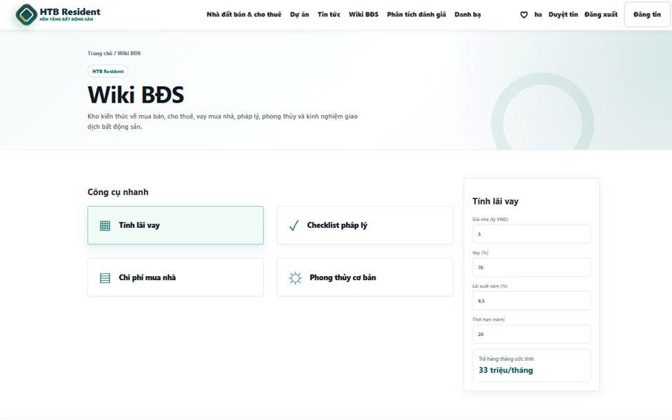
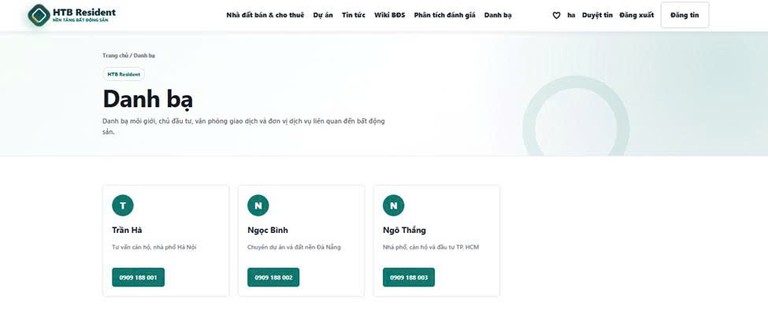
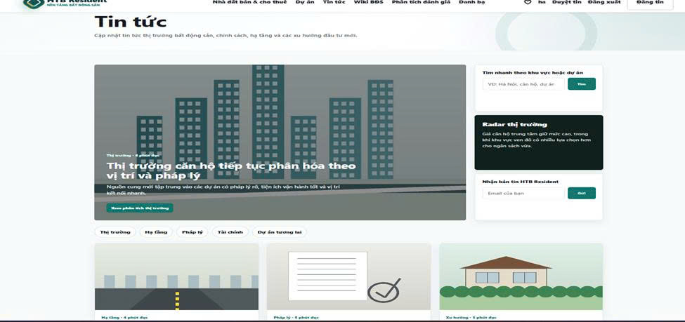
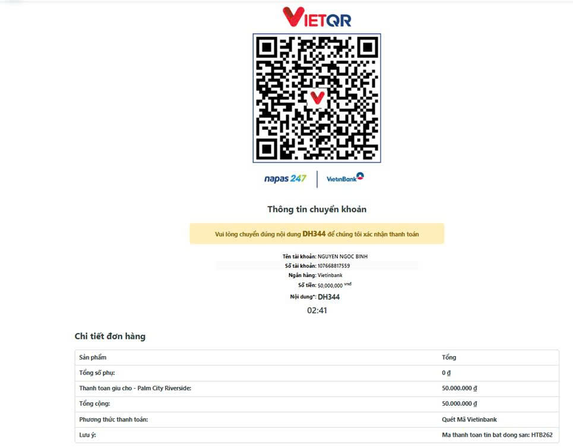

# 🏢 TÊN ĐỀ TÀI: QUẢN LÝ WEB KINH DOANH BẤT ĐỘNG SẢN (HTB RESIDENT)

## 📝 1. Giới thiệu website/hệ thống
*HTB Resident* là một nền tảng quản lý và giao dịch bất động sản trực tuyến hiện đại, được xây dựng trên hệ quản trị nội dung mã nguồn mở WordPress kết hợp tùy biến lập trình hệ thống. Website tập trung giải quyết bài toán minh bạch thông tin bất động sản, hỗ trợ tối ưu hóa trải nghiệm tìm kiếm nhà đất theo phân khúc ngân sách, vị trí địa lý và lối sống cá nhân của khách hàng. Hệ thống thực hiện phân chia danh mục khoa học (Nhà đất bán, Cho thuê, Dự án), tích hợp các bộ lọc thông minh theo khu vực, công cụ tính toán tài chính và cơ chế quản trị kiểm duyệt tin đăng nghiêm ngặt từ người dùng trước khi xuất bản lên hệ thống.

---

## 👥 2. Danh sách thành viên & MSSV từng thành viên
Hệ thống được nghiên cứu và phát triển bởi nhóm sinh viên thuộc khoa Công nghệ Thông tin - Trường Đại học Điện lực:
* *Nguyễn Ngọc Bình* - MSSV: 23810310021
* *Ngô Văn Thắng* - MSSV: 23810310401
* *Đặng Trần Hà* - MSSV: 23810310029

---

## 🛠️ 3. Phân công nhiệm vụ cụ thể
Dựa trên vai trò và khối lượng công việc thực hiện đóng góp vào mã nguồn dự án công nghệ:
* *Sinh viên Nguyễn Ngọc Bình:* Chịu trách nhiệm khởi tạo hệ thống, xây dựng nhân lõi phần mềm WordPress; cấu hình và thiết lập các trường dữ liệu Custom Post Type (CPT); trực tiếp lập trình phát triển Plugin máy tính tính toán giá trị BĐS (binh-calc); tổng hợp chỉnh sửa tài liệu báo cáo chuyên đề Chương 1 và Chương 2.
* *Sinh viên Ngô Văn Thắng:* Chịu trách nhiệm thiết kế, tối ưu hóa giao diện mỹ thuật UI/UX của hệ thống (Sử dụng Astra Theme kết hợp công cụ Elementor); xây dựng cấu trúc danh mục nội dung và bổ sung dữ liệu bất động sản mẫu; chỉnh sửa tài liệu báo cáo chuyên đề Chương 3.
* *Sinh viên Đặng Trần Hà:* Chịu trách nhiệm cấu hình hệ thống nghiệp vụ thanh toán đặt cọc giữ chỗ bất động sản trực tuyến (Tích hợp cổng quét mã VietQR tự động qua WooCommerce); thực hiện vận hành quy trình chuyển đổi, triển khai hạ tầng mã nguồn từ Localhost lên không gian Hosting; chỉnh sửa tài liệu báo cáo chuyên đề Chương 4.

---

## 💻 4. Công nghệ sử dụng
* *Nền tảng lõi quản trị (CMS):* WordPress (Phiên bản hệ thống 6.9.4)
* *Ngôn ngữ lập trình chính:* PHP (Xử lý nghiệp vụ logic Backend), HTML5, CSS3, JavaScript (Xử lý tương tác Frontend)
* *Hệ quản trị cơ sở dữ liệu:* MySQL / MariaDB (Quản lý trực quan thông qua công cụ phpMyAdmin)
* *Môi trường máy chủ ảo cục bộ:* XAMPP Control Panel
* *Công cụ kiểm soát phiên bản nguồn:* Git & GitHub

---

## 🚀 5. Hướng dẫn cài đặt
1. *Tải bộ mã nguồn:* Tiến hành tải toàn bộ mã nguồn của dự án từ kho chứa lưu trữ này về máy tính cá nhân. Giải nén dữ liệu và di chuyển toàn bộ thư mục vào đường dẫn máy chủ ảo cục bộ của bạn: C:\xampp\htdocs\batdongsan (hoặc phân vùng ổ đĩa thiết lập môi trường XAMPP tương ứng trên máy tính).
2. *Khởi chạy dịch vụ:* Khởi động ứng dụng *XAMPP Control Panel* trên máy tính, nhấn chọn nút *Start* để kích hoạt đồng thời hai dịch vụ hệ thống bắt buộc là *Apache* và *MySQL*.
3. *Cấu hình Cơ sở dữ liệu:*
   * Mở trình duyệt web bất kỳ, truy cập giao diện quản trị theo địa chỉ: http://localhost/phpmyadmin/.
   * Tiến hành khởi tạo một cơ sở dữ liệu trống mới với tên định danh chính xác là: batdongsan.
   * Chọn mục *Import* (Nhập) trên thanh công cụ, bấm chọn tệp tin sao lưu dữ liệu batdongsan.sql (được đính kèm sẵn trong thư mục gốc của bộ mã nguồn này) và nhấn xác nhận Import để hệ thống tự động phục hồi cấu trúc bảng dữ liệu.
4. *Kiểm tra kết nối cấu hình:* Mở tệp tin wp-config.php tại thư mục gốc mã nguồn để kiểm tra đảm bảo các tham số kết nối (DB_NAME, DB_USER, DB_PASSWORD) trùng khớp với tài khoản MySQL trên Localhost.

---

## 🏃‍♂️ 6. Hướng dẫn chạy project
Sau khi hoàn thành các bước cài đặt môi trường hạ tầng ở trên, hệ thống có thể vận hành ổn định trên cả hai môi trường:

### Môi trường máy chủ cục bộ (Localhost):
* *Giao diện người dùng (Client):* http://localhost/batdongsan/
* *Giao diện trang quản trị chuyên sâu (Backend):* http://localhost/batdongsan/wp-admin/

### Môi trường trực tuyến đã triển khai (Deploy Online):
* *Địa chỉ chạy trực tuyến dự án:* https://batdongsanhtb.io.vn/batdongsan/

---

## 🔐 7. Tài khoản demo (nếu có)
* *Tài khoản Quản trị viên hệ thống (Administrator):*
  * *Username:* ha
  * *Password:*Tranha05@
* *Tài khoản Người dùng / Khách hàng thành viên trải nghiệm (Demo):*
  * *Username:* khachdemo
  * *Password:* Khach@123456

---

## 📷 8. Hình ảnh minh họa hệ thống

(Hệ thống hình ảnh giao diện thực tế của nền tảng HTB Resident được trích xuất đồng bộ theo tài liệu báo cáo):

### 🏠 Giao diện chính & Tìm kiếm

---

### 🔍 Bộ lọc sản phẩm Bất động sản

---

### 📈 Phân tích đánh giá thị trường (Market Lab)

---

### 🏗️ Quản lý dự án đang hình thành

---

### 🧮 Công cụ Wiki BĐS & Tính lãi vay

---

### 📇 Danh bạ môi giới & Chủ đầu tư

---

### 📰 Trang Tin tức thị trường

---

### 💳 Tích hợp cổng quét mã thanh toán VietQR

---

## 🎥 9. Link video demo
* *Link đường dẫn Video Demo chức năng hệ thống:* [https://drive.google.com/file/d/1024cd-Dai-Buld8Yn000iXRTxdPCYLvP/view?usp=drive_link],
[https://youtu.be/RR4V0Qhzqq0]
---

## 🌐 10. Link online đã deploy (nếu có)
* *Trạng thái triển khai thực tế:* Hệ thống website đã được cấu hình trỏ cấu hình bản ghi tên miền thành công thông qua nhà cung cấp dịch vụ iNET và hạ tầng bảo mật mạng CDN Cloudflare, hiện tại đang vận hành trực tuyến công khai ổn định tại địa chỉ hạ tầng: [https://batdongsanhtb.io.vn/batdongsan/](https://batdongsanhtb.io.vn/batdongsan/)
